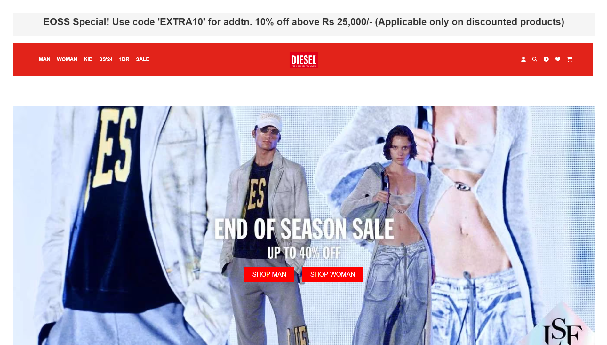

<div align="center">


[GOO LIVE]   

### _Shopping_, Website

<div align="center">
      
      
      
      
      <br>
 </div>

---

</div>

<h1 align="center">About DieselIndia Clone</h1>

## Summary

We have developed a fully responsive shopping website inspired by [DieselClone](https://www.dieselindia.com/). This website is designed with a robust backend integration and full authentication, leveraging the latest technologies in web development to ensure a seamless user experience.
## Features

#### Frontend

It's Frontend is fully made up of React JS Frameworks, React Slick, React Multi-Carousel and React Bootstrap CSS.

#### Backend

Node JS: Used for data storage and management in the database.


# Docs

- Table of Contents

  - [Codebase](#codebase)

    - [Technologies](#technologies)
    - [Folder Structure](#folder-structure)

  - [Project Setup](#project-setup)

    - [First time setup](#first-time-setup)
    - [Installation](#installation)
    - [Running the app locally](#running-the-app-locally)


## Codebase

### Technologies

With the ground rules out of the way, let's talk about the coarse architecture of this mono repo:

Here is a list of all the big technologies we use:

<div align="center">
      
      
      
      
      
</div>

<div align="center">
      <br/>
      
      
</div>

### Folder structure

```sh

prayas/dieselClone

├── public
├── src #Contains all React FronEnd Files
    ├── assets #Contains all assets used in project
        ├── images #Contains all the products images
    ├── Component_Akash  #Component worked by Akash
    ├── Component_Arjit  #Component worked by Arjit
    ├── Component_Ayush  #Component worked by Ayush
    ├── Component_Ipsa  #Component worked by Ipsa
    ├── Component_Jaydip  #Component worked by Jaydip
    ├── Component_Sadiqua  #Component worked by Sadiqua
    ├── Akash_Section #Contains all Sectional Pages
        
├── Arjit-db4.json #Contains all backend files

```

## Project Setup

### First time setup

### FRONTEND
The first step to running DieselClone locally is downloading the code by cloning the repository:

```sh

git clone https://github.com/akashdey23/prayas.git
```

### Installation

DieselIndia Clone has a single installation step:

- **Install the dependencies**:

```sh

cd prayas
cd dieselClone
npm install

```

You've now finished installing everything! Let's start :100:

Ps: if you're getting error installing the dependencies, try --force command along with npm install. For example

```sh

npm install --force

```

Now you're ready to run the app locally and sign into your local instance!

<!-- ### BACKEND

```sh
cd src/backend
npm install (or npm install --force)
```
 -->

## Running the app locally
#### Install the components

##### Install react-router-dom
```
npm install react-router-dom@^6.25.1
```
##### Install React Multi Carousel
```
npm install react-multi-carousel
```
#### Start the servers and Land on the Page


To Start the FrontEnd

```
in the root folder dieselClone
npm run dev
```

<div  align="center"></div>


## Screenshots




## Feedback

If you have any feedback or suggestions please reach out to the Project-Maintainer [Akash Dey](https://github.com/akashdey23)


# Contributors💪

<p align="center">
  <a href="https://github.com/Ayush-silicon">
    
  </a>
  <a href="https://github.com/Arjit-dev">
    
  </a>
  <a href="https://github.com/sadiquafarheen2003">
    
  </a>
  <a href="https://github.com/ipsa2004">
    
  </a>
  <a href="https://github.com/Jaydip-2005">
    
  </a>
  <a href="https://github.com/akashdey23">
    
  </a>
</p>
